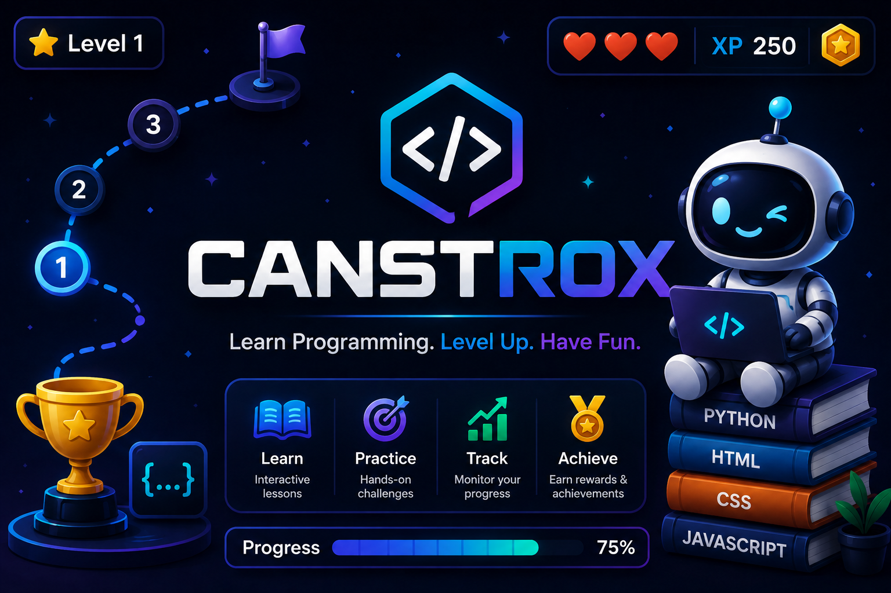

# Canstrox



[](https://github.com/<your-username>/canstrox)
[](#)
[](#)
[](#)
[](#)
[](#)
[](#copyright)

> Learn Programming. Level Up. Have Fun.

Canstrox is a gamified web-based programming learning platform that transforms traditional programming education into an interactive and engaging experience through levels, challenges, achievements, and progress tracking.

**Built for Reverie Hacks 2026** 🚀

---

## Table of Contents

- [Vision](#vision)
- [Current Features](#current-features)
- [Technologies](#technologies)
- [Project Structure](#project-structure)
- [Getting Started](#getting-started)
- [Existing Foundation (Before Reverie Hacks 2026)](#existing-foundation-before-reverie-hacks-2026)
- [Built During Reverie Hacks 2026](#built-during-reverie-hacks-2026)
- [Future Roadmap](#future-roadmap)
- [Repository](#repository)
- [Copyright](#copyright)

---

## Vision

Programming education should feel like playing a game instead of reading long tutorials.

Canstrox is designed to improve learner engagement through gamification while providing a scalable architecture that supports multiple programming languages and interactive question types.

---

## Current Features

### Learning Engine

- Dynamic question loading
- JSON-based question system
- Modular architecture
- Multiple question types

**Supported question types:**

- Multiple Choice
- Sequence
- Match
- Fill in the Blank
- Code Sequence

### Game Elements

- Level-based learning
- Progress tracking
- Interactive challenges
- Responsive interface

---

## Technologies

**Frontend**
- HTML5
- CSS3
- Vanilla JavaScript

**Backend Services**
- Firebase Authentication
- Cloud Firestore

**Hosting**
- Netlify

**Version Control**
- Git & GitHub

---

## Project Structure

```
index.html            # Landing / main entry point
map.html / map.js / map.css        # Interactive level map interface
sequence.html / sequence.js        # Sequence-type question module
match.html / match.js              # Match-type question module
fill-blank.html / fill-blank.js    # Fill-in-the-blank question module
code-sequence.html / code-sequence.js  # Code sequence question module
questions.json         # JSON-based question bank
script.js              # Core application logic
config.js              # Firebase / app configuration
style.css              # Global styling
```

---

## Getting Started

Canstrox is a static, front-end-first project — no build step is required to run it locally.

1. **Clone the repository**
   ```bash
   git clone https://github.com/<your-username>/canstrox.git
   cd canstrox
   ```

2. **Configure Firebase**
   Add your Firebase project credentials in `config.js`:
   ```js
   const firebaseConfig = {
     apiKey: "YOUR_API_KEY",
     authDomain: "YOUR_AUTH_DOMAIN",
     projectId: "YOUR_PROJECT_ID",
     // ...other config values
   };
   ```

3. **Run locally**
   Open `index.html` directly in your browser, or serve the folder with a lightweight local server (recommended for Firebase/module behavior), e.g.:
   ```bash
   npx serve .
   ```

4. **Deploy**
   The project is configured for static hosting on **Netlify** — connect the repository and deploy directly, no build command required.

---

## Existing Foundation (Before Reverie Hacks 2026)

The following components existed before the hackathon began:

- Initial frontend interface
- Modular quiz engine
- JSON question system
- Multiple question types
- Basic map interface
- Initial Firebase configuration
- Basic project architecture

This foundation serves as the starting point for the hackathon build.

---

## Built During Reverie Hacks 2026

The following features are planned to be implemented and improved during the hackathon:

- Complete authentication flow
- XP system
- Hearts system
- Player progression
- Cloud progress synchronization
- Improved animations
- Better accessibility
- Enhanced UI/UX
- New learning content
- AI-powered learning assistance
- Performance optimization
- Documentation
- Live deployment
- Demo presentation

*This section will be updated continuously throughout the hackathon.*

---

## Future Roadmap

Planned future features include:

- AI Personalized Learning
- Coding Playground
- Daily Challenges
- Multiplayer Learning
- Leaderboards
- Achievement System
- Teacher Dashboard
- Analytics
- Additional Programming Languages
- Mobile Application

---

## Repository

This repository is being actively developed as part of **Reverie Hacks 2026**.

Development progress can be tracked through the commit history.

---

## Copyright

Copyright © 2026 Prathmesh Bhosale
All Rights Reserved.

This repository is publicly available for demonstration and hackathon evaluation purposes only.
No permission is granted to copy, modify, distribute, or use this code without prior written permission from the copyright holder.
